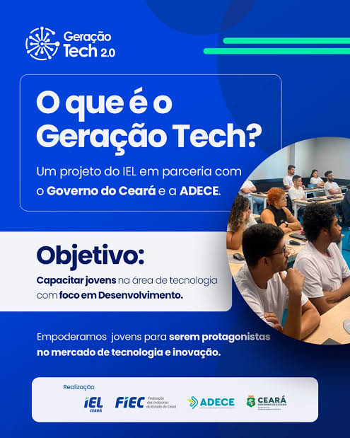

# 🚀 Geração Tech - Projeto

Projeto desenvolvido durante o curso intensivo **Geração Tech**, oferecido pelo IEL e Governo do Ceará, com foco em desenvolvimento web full stack.

## 🛠️ Tecnologias Utilizadas

  

  
  
  
  
  
  
  
  
  

  

## 📚 Sobre o Projeto

Aplicação desenvolvida com foco em consolidar habilidades de front-end e back-end, utilizando ferramentas modernas de desenvolvimento web.

## 👨‍💻 Autor

Feito por **IsmaelBarroso**  
[GitHub-Autor](https://github.com/IsmaelBarroso)

